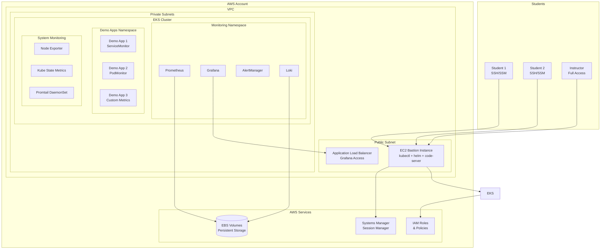

# Design Document: Kubernetes Observability Lab Environment

## Overview

Este documento descreve o design para criar um ambiente de aula completo que demonstra observabilidade no Kubernetes usando Amazon EKS e uma instância EC2 como estação de trabalho. O ambiente será otimizado para ensino, com foco em demonstrações práticas de Prometheus, Grafana, Loki, ServiceMonitor, PodMonitor e melhores práticas de observabilidade.

## Architecture

### High-Level Architecture



### Component Architecture

**Infrastructure Layer:**
- **EKS Cluster**: Managed Kubernetes cluster com 3+ worker nodes
- **EC2 Bastion**: Instância t3.medium com ferramentas de desenvolvimento
- **VPC**: Rede isolada com subnets públicas e privadas
- **ALB**: Load balancer para acesso externo ao Grafana

**Observability Stack:**
- **kube-prometheus-stack**: Helm chart com Prometheus, Grafana, AlertManager
- **Loki Stack**: Agregação de logs com Promtail
- **Demo Applications**: Aplicações instrumentadas para demonstração

## Components and Interfaces

### 1. EKS Cluster Configuration

**Cluster Specifications:**
```yaml
cluster_name: "observability-lab-cluster"
kubernetes_version: "1.28"
node_groups:
  - name: "worker-nodes"
    instance_types: ["t3.medium"]
    min_size: 2
    max_size: 6
    desired_size: 3
    capacity_type: "SPOT"  # Cost optimization
```

**Add-ons:**
- AWS Load Balancer Controller
- EBS CSI Driver
- CoreDNS
- kube-proxy
- VPC CNI

### 2. EC2 Bastion Instance

**Instance Configuration:**
```yaml
instance_type: "t3.medium"
ami: "ubuntu-22.04-lts"
storage: "30GB gp3"
security_groups:
  - ssh_access
  - outbound_all
```

**Pre-installed Tools:**
- kubectl (latest stable)
- helm (v3.12+)
- AWS CLI v2
- code-server
- Docker
- jq, curl, htop
- git

**User Data Script:**
```bash
#!/bin/bash
# Install kubectl
curl -LO "https://dl.k8s.io/release/$(curl -L -s https://dl.k8s.io/release/stable.txt)/bin/linux/amd64/kubectl"
sudo install -o root -g root -m 0755 kubectl /usr/local/bin/kubectl

# Install helm
curl https://raw.githubusercontent.com/helm/helm/main/scripts/get-helm-3 | bash

# Configure kubeconfig for EKS
aws eks update-kubeconfig --region us-east-2 --name observability-lab-cluster

# Install code-server
curl -fsSL https://code-server.dev/install.sh | sh
systemctl enable --now code-server@ubuntu
```

### 3. Observability Stack Deployment

**Helm Values for kube-prometheus-stack:**
```yaml
prometheus:
  prometheusSpec:
    retention: 7d
    storageSpec:
      volumeClaimTemplate:
        spec:
          storageClassName: gp3
          accessModes: ["ReadWriteOnce"]
          resources:
            requests:
              storage: 20Gi
    resources:
      requests:
        memory: 1Gi
        cpu: 500m
      limits:
        memory: 2Gi
        cpu: 1000m

grafana:
  service:
    type: LoadBalancer
    annotations:
      service.beta.kubernetes.io/aws-load-balancer-type: "nlb"
  persistence:
    enabled: true
    storageClassName: gp3
    size: 10Gi
  adminPassword: "admin123"
  
alertmanager:
  alertmanagerSpec:
    storage:
      volumeClaimTemplate:
        spec:
          storageClassName: gp3
          accessModes: ["ReadWriteOnce"]
          resources:
            requests:
              storage: 5Gi
```

**Loki Stack Configuration:**
```yaml
loki:
  persistence:
    enabled: true
    storageClassName: gp3
    size: 20Gi
  config:
    schema_config:
      configs:
        - from: 2020-10-24
          store: boltdb-shipper
          object_store: filesystem
          schema: v11
    retention_deletes_enabled: true
    retention_period: 168h  # 7 days

promtail:
  config:
    clients:
      - url: http://loki:3100/loki/api/v1/push
```

### 4. Demo Applications

**Application 1: Web Service with ServiceMonitor**
```yaml
apiVersion: apps/v1
kind: Deployment
metadata:
  name: demo-web-app
  namespace: demo-apps
spec:
  replicas: 2
  selector:
    matchLabels:
      app: demo-web-app
  template:
    metadata:
      labels:
        app: demo-web-app
    spec:
      containers:
      - name: web-app
        image: nginx:alpine
        ports:
        - containerPort: 80
        - containerPort: 9113  # metrics port
---
apiVersion: monitoring.coreos.com/v1
kind: ServiceMonitor
metadata:
  name: demo-web-app-monitor
  namespace: demo-apps
spec:
  selector:
    matchLabels:
      app: demo-web-app
  endpoints:
  - port: metrics
    interval: 30s
    path: /metrics
```

**Application 2: Background Job with PodMonitor**
```yaml
apiVersion: batch/v1
kind: CronJob
metadata:
  name: demo-cronjob
  namespace: demo-apps
spec:
  schedule: "*/5 * * * *"
  jobTemplate:
    spec:
      template:
        metadata:
          labels:
            app: demo-cronjob
        spec:
          containers:
          - name: job
            image: busybox
            command: ["sh", "-c", "echo Processing job && sleep 30"]
          restartPolicy: OnFailure
---
apiVersion: monitoring.coreos.com/v1
kind: PodMonitor
metadata:
  name: demo-cronjob-monitor
  namespace: demo-apps
spec:
  selector:
    matchLabels:
      app: demo-cronjob
  podMetricsEndpoints:
  - port: metrics
    interval: 60s
```

### 5. Infrastructure as Code

**Terraform Structure:**
```
terraform/
├── main.tf                 # Main configuration
├── variables.tf            # Input variables
├── outputs.tf              # Output values
├── modules/
│   ├── vpc/               # VPC and networking
│   ├── eks/               # EKS cluster
│   ├── bastion/           # EC2 bastion instance
│   └── iam/               # IAM roles and policies
└── environments/
    ├── dev/               # Development environment
    └── prod/              # Production environment
```

**Key Terraform Resources:**
```hcl
# EKS Cluster
resource "aws_eks_cluster" "observability_lab" {
  name     = var.cluster_name
  role_arn = aws_iam_role.eks_cluster.arn
  version  = var.kubernetes_version

  vpc_config {
    subnet_ids              = var.subnet_ids
    endpoint_private_access = true
    endpoint_public_access  = true
  }

  depends_on = [
    aws_iam_role_policy_attachment.eks_cluster_policy,
  ]
}

# EC2 Bastion Instance
resource "aws_instance" "bastion" {
  ami                    = data.aws_ami.ubuntu.id
  instance_type          = var.bastion_instance_type
  key_name              = var.key_pair_name
  vpc_security_group_ids = [aws_security_group.bastion.id]
  subnet_id             = var.public_subnet_id
  iam_instance_profile  = aws_iam_instance_profile.bastion.name
  
  user_data = base64encode(templatefile("${path.module}/user-data.sh", {
    cluster_name = aws_eks_cluster.observability_lab.name
    region       = var.aws_region
  }))

  tags = {
    Name = "observability-lab-bastion"
  }
}
```

## Data Models

### Student Access Control

**RBAC Configuration:**
```yaml
apiVersion: rbac.authorization.k8s.io/v1
kind: Role
metadata:
  namespace: demo-apps
  name: student-role
rules:
- apiGroups: [""]
  resources: ["pods", "services", "configmaps"]
  verbs: ["get", "list", "watch"]
- apiGroups: ["apps"]
  resources: ["deployments", "replicasets"]
  verbs: ["get", "list", "watch"]
- apiGroups: ["monitoring.coreos.com"]
  resources: ["servicemonitors", "podmonitors"]
  verbs: ["get", "list", "watch", "create", "update", "patch"]
```

### Lab Exercise Structure

**Exercise Metadata:**
```yaml
exercises:
  - id: "ex01"
    title: "Deploy kube-prometheus-stack"
    duration: "30 minutes"
    objectives:
      - "Install Prometheus Operator"
      - "Configure Grafana data sources"
      - "Verify monitoring stack"
    validation:
      - "All pods in monitoring namespace are running"
      - "Grafana is accessible via LoadBalancer"
      - "Prometheus targets are up"
  
  - id: "ex02"
    title: "Create ServiceMonitor"
    duration: "20 minutes"
    objectives:
      - "Deploy sample application"
      - "Create ServiceMonitor resource"
      - "Verify metrics collection"
    validation:
      - "ServiceMonitor is created successfully"
      - "Prometheus discovers the target"
      - "Metrics are visible in Grafana"
```

## Correctness Properties

Agora vou usar a ferramenta de prework para analisar os critérios de aceitação:
*A property is a characteristic or behavior that should hold true across all valid executions of a system-essentially, a formal statement about what the system should do. Properties serve as the bridge between human-readable specifications and machine-verifiable correctness guarantees.*

### Property Reflection

Após análise dos critérios de aceitação, identifiquei algumas propriedades que podem ser consolidadas:

- Propriedades relacionadas à instalação de ferramentas (2.1, 2.5, 2.6) podem ser combinadas em uma propriedade sobre configuração completa do bastion
- Propriedades de monitoramento de infraestrutura (8.1, 8.3, 8.5) podem ser consolidadas
- Propriedades de otimização de custos (7.1, 7.3, 7.4) podem ser combinadas
- Propriedades de acesso e segurança (5.1, 5.3, 5.6) podem ser consolidadas

### Core Properties

**Property 1: EKS Cluster Provisioning**
*For any* lab environment deployment, the EKS cluster should be created with the specified number of worker nodes, appropriate IAM roles, and required add-ons (storage classes, load balancer controller, autoscaling)
**Validates: Requirements 1.1, 1.3, 1.4, 1.5, 1.6**

**Property 2: Bastion Instance Configuration**
*For any* bastion instance deployment, all required tools (kubectl, helm, AWS CLI, monitoring tools) should be installed and properly configured with EKS access
**Validates: Requirements 2.1, 2.2, 2.5, 2.6**

**Property 3: Observability Stack Deployment**
*For any* observability stack installation, all components (Prometheus, Grafana, AlertManager, Loki) should be deployed successfully with persistent storage and proper data source integration
**Validates: Requirements 3.1, 3.2, 3.3, 3.5, 3.7**

**Property 4: Demo Applications Integration**
*For any* demo application deployment, applications should be created with proper ServiceMonitor/PodMonitor configurations and should be automatically discovered by Prometheus
**Validates: Requirements 4.1, 4.2, 4.4**

**Property 5: Multi-Namespace Monitoring**
*For any* application deployed across different namespaces, the monitoring stack should collect metrics and logs from all namespaces while maintaining proper isolation
**Validates: Requirements 4.6, 4.3**

**Property 6: Student Access Control**
*For any* student user account, access should be restricted to appropriate namespaces with least-privilege permissions and proper session isolation
**Validates: Requirements 5.1, 5.2, 5.3, 5.6**

**Property 7: Infrastructure as Code Consistency**
*For any* infrastructure deployment using IaC templates, the same configuration should produce identical AWS resources across different deployments and regions
**Validates: Requirements 6.2, 6.4, 6.7**

**Property 8: Cost Optimization Configuration**
*For any* lab environment, cost optimization features (spot instances, autoscaling, appropriate storage classes) should be configured and functional
**Validates: Requirements 7.1, 7.3, 7.4**

**Property 9: Automated Operations**
*For any* lab environment, automated operations (shutdown, cleanup, scaling) should work correctly according to configured schedules and triggers
**Validates: Requirements 7.2, 7.6, 5.5**

**Property 10: Infrastructure Monitoring**
*For any* deployed lab environment, monitoring should be configured for all infrastructure components (EKS cluster, bastion instance, applications) with appropriate alerting
**Validates: Requirements 8.1, 8.2, 8.3, 8.5**

**Property 11: Exercise Material Availability**
*For any* lab deployment, all required exercise materials, examples, and validation scripts should be available and accessible to students
**Validates: Requirements 9.4, 9.7, 10.1, 10.2, 10.3, 10.4, 10.5, 10.6, 10.7**

## Error Handling

### Infrastructure Failures
- **EKS Cluster Creation Failures**: Implement retry logic and rollback mechanisms
- **Node Group Scaling Issues**: Configure appropriate instance types and availability zones
- **Storage Provisioning Failures**: Implement storage class validation and fallback options

### Application Deployment Failures
- **Helm Chart Failures**: Implement pre-deployment validation and dependency checks
- **Resource Constraints**: Configure resource quotas and limits appropriately
- **Network Connectivity Issues**: Implement health checks and service mesh if needed

### Student Access Issues
- **Authentication Failures**: Implement fallback authentication methods
- **Permission Denied Errors**: Provide clear error messages and troubleshooting guides
- **Session Timeouts**: Implement graceful session handling and automatic cleanup

### Cost Management
- **Budget Overruns**: Implement cost alerts and automatic resource shutdown
- **Resource Leaks**: Implement automated cleanup and resource tagging
- **Spot Instance Interruptions**: Configure appropriate instance types and graceful handling

## Testing Strategy

### Dual Testing Approach

A estratégia de testes combina testes unitários e testes baseados em propriedades para validação completa do ambiente de aula:

**Unit Tests:**
- Validação de configurações específicas do Terraform
- Testes de conectividade entre componentes
- Verificação de casos específicos de acesso de estudantes
- Testes de cenários de falha e recuperação

**Property-Based Tests:**
- Verificação de propriedades universais em diferentes configurações de ambiente
- Testes de deployment consistente com parâmetros aleatórios
- Validação de comportamento sob diferentes cargas de trabalho
- Testes de resiliência com falhas simuladas

### Property Test Configuration

**Framework**: Utilizaremos **Terratest** para testes de infraestrutura e **Ginkgo/Gomega** para testes de Kubernetes, configurados para executar no mínimo 100 iterações por teste de propriedade.

**Test Tagging**: Cada teste de propriedade deve incluir uma tag de comentário referenciando a propriedade do documento de design:
- Formato: `// Feature: kubernetes-observability-lab, Property {number}: {property_text}`

**Exemplo de Configuração:**
```go
// Feature: kubernetes-observability-lab, Property 1: EKS Cluster Provisioning
func TestEKSClusterProvisioning(t *testing.T) {
    for i := 0; i < 100; i++ {
        // Generate random cluster configuration
        clusterConfig := generateRandomClusterConfig()
        
        // Deploy cluster
        terraformOptions := terraform.WithDefaultRetryableErrors(t, &terraform.Options{
            TerraformDir: "../terraform",
            Vars: clusterConfig,
        })
        
        defer terraform.Destroy(t, terraformOptions)
        terraform.InitAndApply(t, terraformOptions)
        
        // Verify cluster properties
        verifyClusterProvisioning(t, terraformOptions)
    }
}
```

### Integration Testing

**End-to-End Lab Scenarios**: Testes completos simulando sessões de aula
**Student Journey Testing**: Validação da experiência completa do estudante
**Instructor Workflow Testing**: Verificação de todos os fluxos do instrutor
**Multi-User Concurrent Testing**: Testes com múltiplos estudantes simultâneos

### Continuous Validation

**Infrastructure Drift Detection**: Monitoramento contínuo de mudanças na infraestrutura
**Cost Monitoring**: Validação contínua de otimizações de custo
**Security Compliance**: Verificação contínua de políticas de segurança
**Performance Benchmarking**: Testes regulares de performance do ambiente

### Lab Exercise Validation

**Exercise Completeness**: Verificação de que todos os exercícios podem ser completados
**Validation Script Testing**: Testes dos scripts de validação dos exercícios
**Documentation Accuracy**: Verificação de que a documentação está atualizada
**Troubleshooting Guide Effectiveness**: Testes dos guias de solução de problemas